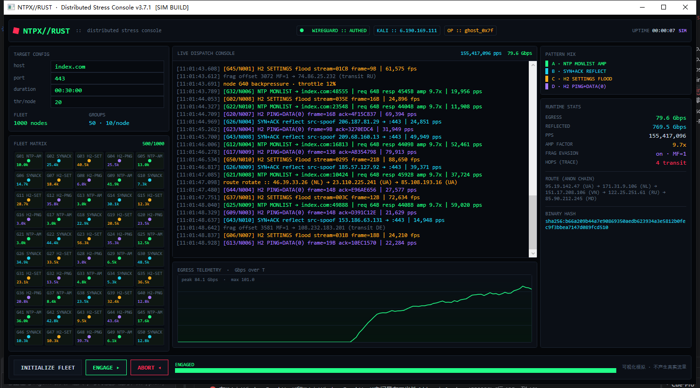

# NTPX//RUST · Distributed Stress Console

> **⚠️ 这是一个纯视觉模拟器 (NON-FUNCTIONAL VISUAL MOCK)。**
> 它**不产生任何真实网络流量**、**不打开任何 socket**、**不发送任何数据包**、**不连接任何目标**。
> 屏幕上出现的每一个数字、日志、IP、曲线都是本地**随机生成**的，仅用于演示 / 影视道具 / UI 美学展示。

一个用 C# / WPF 写的「赛博朋克风分布式压测控制台」界面。看起来像那么回事，实际上啥也不干 —— 双击 exe 就是一个会动的电影道具级控制台，拿去录视频、做演示、装 b 都行。



---

## ✨ 它能看起来像什么

- 顶部 HUD：`WIREGUARD :: AUTHED` · `KALI` 节点 · `OP :: ghost_0x7f` · 运行时长
- 目标配置卡：host / port / duration / threads-per-node（可编辑文本框）
- **50 组 × 10 节点舰队矩阵**，四色 LED 按攻击 pattern 区分
  - `A · NTP MONLIST AMP`（绿）
  - `B · SYN+ACK REFLECT`（青）
  - `C · H2 SETTINGS FLOOD`（琥珀）
  - `D · H2 PING+DATA(0)`（紫）
- 实时滚动彩色控制台日志（时间戳 + 每节点 pattern 行 + IP 分片 / 多跳路由提示）
- 出口遥测折线图（绿色 Gbps 曲线，实时滚动 + 峰值标注）
- 右侧统计：Egress / Reflected / PPS / Amp Factor / Frag Evasion / Hops / 匿名路由链 / 二进制 hash
- 底部控制条：`INITIALIZE FLEET` → `ENGAGE ▸` → `ABORT ◂` + 主进度条

## 🚀 怎么用

直接双击 `NTPX-RUST.exe`（已编译的单文件，无需安装 .NET 运行时）。

1. 点 **INITIALIZE FLEET** —— 1000 节点逐个上线，LED 依次点亮
2. 点 **ENGAGE ▸** —— 流量爬升，日志狂滚，曲线起飞，进入 `ENGAGED`
3. 点 **ABORT ◂** —— 流量衰减，节点排水，回到 `IDLE`

> 标题栏带 `[SIM BUILD]` 徽标，底部常驻 `可视化模拟 · 不产生真实流量` 提示。

## 🛠 从源码构建

需要 .NET 10 SDK（含 WPF 工作负载，Windows）。

```bash
cd ddos-sim
dotnet build -c Debug          # 调试构建

# 发布成单文件 self-contained exe（任意 Windows 双击即跑）
dotnet publish -c Release -r win-x64 ^
  --self-contained true ^
  -p:PublishSingleFile=true ^
  -p:IncludeNativeLibrariesForSelfExtract=true
# 产物：bin\Release\net10.0-windows\win-x64\publish\NTPX-RUST.exe
```

## 🧱 技术栈

- **C# / .NET 10** (Windows)
- **WPF**（XAML 手写暗色主题，无第三方 UI 库）
- `DispatcherTimer` 驱动的纯本地动画，`Random` 生成所有展示数据
- 全部逻辑在 [`ddos-sim/MainWindow.xaml.cs`](ddos-sim/MainWindow.xaml.cs)，无任何网络 / 进程间通信代码

## 📁 结构

```
ddos-sim/
├─ App.xaml / App.xaml.cs        # 入口
├─ MainWindow.xaml               # 暗色控制台 UI 布局
├─ MainWindow.xaml.cs            # 模拟逻辑（假数据 / 日志 / 图表 / 状态机）
└─ ddos-sim.csproj               # 工程文件
```

## ⚖️ 说明

本项目**仅用于界面视觉效果演示**。它不包含、也不调用任何真实的发包 / 反射 / 洪泛能力。
请勿将其用于恐吓、欺诈或任何对他人造成误导的用途。作者不对 misuse 承担责任。

## License

MIT © 2026 sunday-lil
