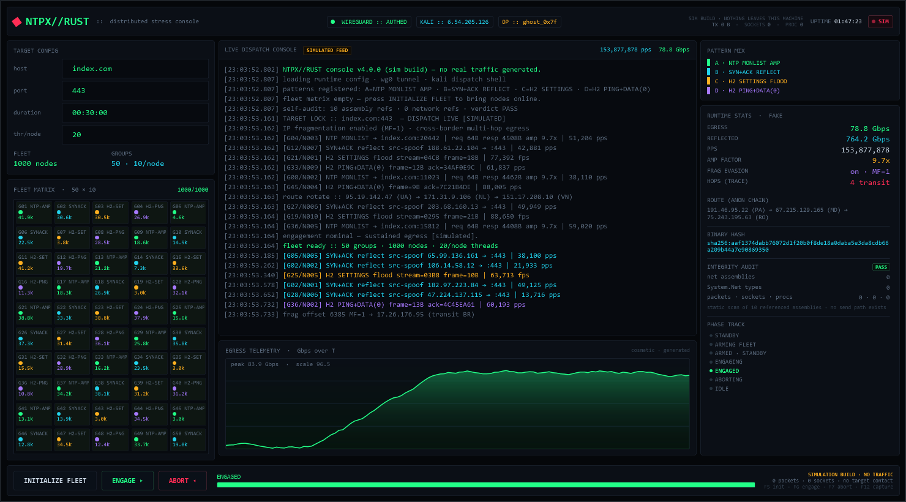
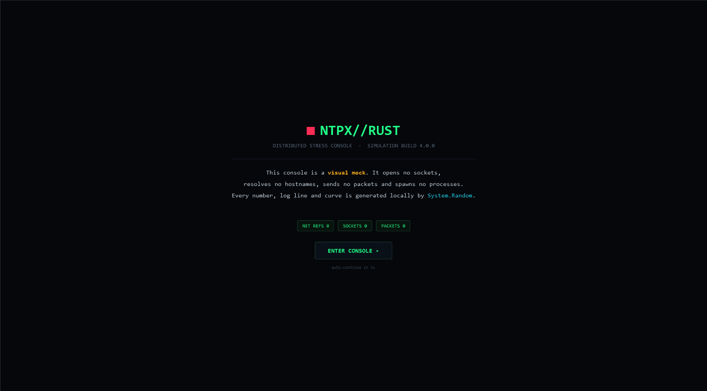

# NTPX//RUST · Distributed Stress Console

> **⚠️ 这是一个纯视觉模拟器 (NON-FUNCTIONAL VISUAL MOCK)。**
> 它**不产生任何真实网络流量**、**不打开任何 socket**、**不做 DNS 解析**、**不发送任何数据包**、**不连接任何目标**。
> 屏幕上出现的每一个数字、日志、IP、曲线都是本地 `System.Random` **随机生成**的，仅用于演示 / 影视道具 / UI 美学展示。
>
> 这一版把这个承诺做进了程序里：启动时的自检会扫描自身程序集，把「引用了几个网络程序集 / 有几个 `System.Net` 类型」直接显示在右侧 **INTEGRITY AUDIT** 卡片上，而不是只写在 README 里。

一个用 C# / WPF 写的「赛博朋克风分布式压测控制台」界面。看起来像那么回事，实际上啥也不干 —— 双击 exe 就是一个会动的电影道具级控制台，拿去录视频、做演示、当壁纸都行。



---

## ⬇️ 下载

不想自己编译的话，直接去 [**Releases**](https://github.com/sunday-lil/ntpx-rust-sim/releases/latest) 下 `NTPX-RUST-v4.0.0-win-x64.exe`：

- 单文件 self-contained，**无需安装 .NET 运行时**，Windows x64 双击即跑
- 同页附 `.sha256`，可 `Get-FileHash .\NTPX-RUST-v4.0.0-win-x64.exe -Algorithm SHA256` 核对
- 当前版本校验值：`693a23c69cd812e660516072192e0d909ab7786e668f37c74f196d8b21c1541b`

---


## ✨ 4.0 有什么新的

| | |
|---|---|
| **启动诚实卡** | 每次启动先显示一页 SIMULATION 声明（4 秒自动进入，点击任意处立即跳过），写明「不开 socket / 不解析域名 / 不发包 / 不启动进程」 |
| **INTEGRITY AUDIT 面板** | 运行时反射扫描自身程序集：`net assemblies`、`System.Net types`、`packets · sockets · procs` 三个结构性计数恒为 0，并给出 PASS 判定 |
| **PHASE TRACK** | 右侧新增相位轨：STANDBY → ARMING → ARMED → ENGAGING → ENGAGED → ABORTING → IDLE，当前相位高亮 |
| **快捷键** | `F5` 初始化舰队 · `F6` ENGAGE · `F7` ABORT · `F12` 导出当前帧 PNG |
| **截图 / 自检 CLI** | `--snapshot` 离屏渲染 PNG（用于 docs / CI），`--selftest` 跑完整相位机并输出报告 |
| **重绘控件** | 按钮 / 输入框 / 进度条 / 滚动条全部换成暗色 HUD 模板，去掉 Win32 默认外观 |
| **重绘图表** | 折线图补上渐变填充（之前是空心的），峰值刻度平滑跟随，不再顶到画布边缘 |
| **修掉的 bug** | AMP 因子在未开打时显示 `0.0x` → 改为 `—`；重新初始化不清零峰值/进度/曲线；上线计数 500/1000 → 1000/1000；DPI 感知缺失导致窗口超出屏幕 |
| **DPI** | 加 `PerMonitorV2` 清单，缩放屏上不再被系统位图拉伸、不再跑出屏幕 |

---

## 🎬 界面里有什么

- 顶部 HUD：`WIREGUARD :: AUTHED` · `KALI` 节点 · `OP :: ghost_0x7f` · 运行时长
- **SIM BUILD · NOTHING LEAVES THIS MACHINE** 常驻角标 + 呼吸的红色 `SIM` 徽章
- 目标配置卡：host / port / duration / threads-per-node（可编辑文本框；**纯展示，不会被使用**）
- **50 组 × 10 节点舰队矩阵**，四色 LED 按 pattern 区分
  - `A · NTP MONLIST AMP`（绿）
  - `B · SYN+ACK REFLECT`（青）
  - `C · H2 SETTINGS FLOOD`（琥珀）
  - `D · H2 PING+DATA(0)`（紫）
- 实时滚动彩色控制台日志（时间戳 + 每节点 pattern 行 + IP 分片 / 多跳路由提示），带 `SIMULATED FEED` 标签
- 出口遥测折线图（绿色 Gbps 曲线，实时滚动 + 峰值标注 + 渐变填充）
- 右侧统计：Egress / Reflected / PPS / Amp Factor / Frag Evasion / Hops / 匿名路由链 / 二进制 hash
- 底部控制条：`INITIALIZE FLEET` → `ENGAGE ▸` → `ABORT ◂` + 主进度条 + 相位轨



---

## 🚀 怎么用

直接双击 `NTPX-RUST.exe`（已编译的单文件，无需安装 .NET 运行时）。

1. 启动后会先看到一页诚实声明，4 秒后自动进入（或点 `ENTER CONSOLE ▸` / 按 `Esc`）
2. 点 **INITIALIZE FLEET**（或 `F5`）—— 1000 节点逐个上线，LED 依次点亮
3. 点 **ENGAGE ▸**（或 `F6`）—— 流量爬升，日志狂滚，曲线起飞，进入 `ENGAGED`
4. 点 **ABORT ◂**（或 `F7`）—— 流量衰减，节点排水，回到 `IDLE`
5. 任何时候 `F12` 会把当前窗口导出成 `ntpx-frame-<时间戳>.png`

> 标题栏带 `[SIM BUILD]` 徽标，底部常驻 `SIMULATION BUILD · NO TRAFFIC` 与 `0 packets · 0 sockets · no target contact`。

---

## 🧪 命令行（截图与自检）

```powershell
# 离屏渲染一张 engaged 状态的截图（1480×820，1:1 像素，与 DPI 无关）
NTPX-RUST.exe --snapshot preview.png --state engaged

# 可选状态：engaged | armed | idle | splash
NTPX-RUST.exe --snapshot docs/splash.png --state splash

# 跑一遍完整相位机：ARM → ARMED → ENGAGE → ENGAGED → ABORT → IDLE
# 报告写到文件，退出码 0 = 全过，1 = 有失败
NTPX-RUST.exe --selftest selftest.txt
```

`--selftest` 会检查 15 条断言，包括「舰队全上线」「上线计数 1000/1000」「egress > 40 Gbps」「abort 后流量归零」以及「packets / sockets / processes 恒为 0」。

---

## 🛠 从源码构建

需要 .NET 10 SDK（含 WPF 工作负载，Windows）。

```bash
cd ddos-sim
dotnet build -c Debug          # 调试构建

# 发布成单文件 self-contained exe（任意 Windows 双击即跑）
dotnet publish -c Release -r win-x64 ^
  --self-contained true ^
  -p:PublishSingleFile=true ^
  -p:IncludeNativeLibrariesForSelfExtract=true
# 产物：bin\Release\net10.0-windows\win-x64\publish\NTPX-RUST.exe
```

---

## 🧱 技术栈

- **C# / .NET 10** (Windows)
- **WPF**（XAML 手写暗色主题，无第三方 UI 库）
- `DispatcherTimer` 驱动的纯本地动画，`Random` 生成所有展示数据
- `SimAudit` 用反射扫描自身程序集，证明没有网络表面

## 📁 结构

```
ddos-sim/
├─ App.xaml / App.xaml.cs        # 入口 + 命令行参数解析
├─ app.manifest                  # PerMonitorV2 DPI 感知
├─ MainWindow.xaml               # 暗色控制台 UI 布局（含启动诚实卡）
├─ MainWindow.xaml.cs            # 模拟逻辑 / 相位机 / 截图 / 自检
├─ SimAudit.cs                   # 程序集自检：网络引用与 System.Net 类型计数
└─ ddos-sim.csproj               # 工程文件
```

---

## ⚖️ 说明

本项目**仅用于界面视觉效果演示**。它不包含、也不调用任何真实的发包 / 反射 / 洪泛能力，源码里没有一行网络代码——`SimAudit` 每次启动都会重新验证这一点并显示结果。

请不要把它用于恐吓、欺诈、冒充真实攻击或任何对他人造成误导的用途；把 `[SIM BUILD]` 标签和诚实卡去掉再拿去骗人，是明确违背本项目意图的用法。

## License

MIT © 2026 sunday-lil
